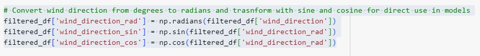

# Wind Speed Analysis

## Introduction
This project—the last I completed while earning my Master's in Data Science—was inspired by my avoidance of high winds while riding my bicycle. The research aims to use local weather data, extending back to 1996, to predict and gain insights into wind speed.
More specifically, I am investigating how historical weather data can be harnessed to predict wind speed for route selection. This project involves applying linear regression techniques and tree models to predict wind speed. The linear regression techniques serve as a baseline. Before using these models, I employ various methods to preprocess the data, including transforming the hourly data into daily aggregates. The restructured data provides daily averages of specific weather events from January 1996 to February 2024.
The weather data originates from the Open Weather API and comes in JSON format. Each hourly entry provides a granular view of historical weather conditions, detailing hourly data from January 1996. The data includes minimum and maximum temperatures, cloud coverage, weather conditions, wind speed, wind direction, pressure, and weather IDs signifying snow, thunderstorms, rain, etc.

## Data Preprocessing

### Sample JSON Data from the Open Weather API
As mentioned, the data comes in JSON format. Using Pandas to read in the file I noticed the high quality of the data but there were numerous nested dictionaries within along with some NaNs that would have to be addressed.
I converted the data into daily aggregates using Pandas and engineered some custom features.
Snow, rain, temperature, pressure, humidity, and wind speed were all converted to daily averages.
I converted specific weather codes to daily counts (e.g., on this day, there were 5 hours of snow).
Using the Brock model, I engineered a day length feature based on the year's day. This required consecutively numbering each day, which was easier than getting the same information from another API.
Well into EDA, I realized there was a problem with the wind direction component of the data. Since I would perform linear regression, using circular metrics to make predictions or generate correlations made little sense. Thus, I engineered two more features, sine and cosine of the wind direction, to compensate.

### Converting directions into sine and cosine values

## Exploratory Data Analysis and Visualizations

### Polar Plot
First, I wanted to create a polar plot to give me a general idea of the direction in which the wind is strongest. I made a new dataframe with windspeed averages and used Plotly to create the polar plot.

Winds are usually the weakest when coming from the north and strongest when coming from the West, East, and South.

### Correlation Bar Chart and Density Plots
Second, I created a correlation bar chart to indicate which weather variables strongly correlated with wind speed. I also created density plots to assess the shape of the data.

Correlations are the strongest with pressure, directions, and precipitation.

Some of the weather variables are normally distributed and others are not.

## Baseline Models: Simple Linear Regression
Initially, I tested the assumptions of linearity for each variable. The results were promising. However, many of the variables did not appear to have a linear relationship with wind speed. Using Sci-Kit Learn, I split the data with an 80/20 ratio, scaled it, and pipelined it to streamline my workflows.
SGD, Lasso, and Ridge regression yielded similar results; all had poor R-squared and MSE/RMSE scores. I moved on to more complex models to see if they could improve predictions.

All regression models had similar results. Each accounted for roughly 25% of the variance.

## More Complexity: Random Forest and Decision Tree Regressors
Poor results were not a surprise. Weather is complex, and I suspected a more complex model would be necessary to predict wind speed. Moving on, I selected both random forest and decision tree regressors using MSE and R-squared as metrics.

### Random Forest Regressor Set-Up
To determine the best set of parameters for the model, I utilized grid search with cross-validation. I set the parameter grid for [50, 100, 200, 300] estimators and a maximum depth of [None, 10, 20, 30]. I split the data at an 80/20 ratio. The model was fitted on five folds for each of the 16 candidates, for 80 model fits. Grid search achieved an MSE of 4.97.
The model achieved MSE/RMSE of 5.23/2.29 on the test data and an R-squared of .045. Right away, I could tell the additional complexity the random forest regressor offered was paying off.
Using Sci-Kit Learn I started inspecting various parts of the tree to see where the splits were. It became apparent that the model often made decisions based on wind direction and barometric pressure. Below is a visualization of the top of the tree. The root node splits the tree using sine wind direction, and the child nodes use snow, wind direction, precipitation, and pressure.

A small portion of the random forest regressor model.

### Feature Importance
I also used the feature importance capabilities in Sci-Kit Learn to determine which features were most influential in building the model.

Wind direction, pressure, and humidity were among the most important features.
I was not surprised to see wind direction, pressure, and humidity high on the list. However, I was surprised to see daylength had as much of an influence as it did.

### Decision Tree Regressor
As I did with the Random Forest Regressor, I set up my parameters after some experimentation. Below are my choices:

Fine-tuning the Decision Tree Regressor.

### Decision Tree Snippet
Here is a snippet of the decision tree showing the most commonly made splits. They include wind direction, pressure, and weather conditions such as clear, humidity, and precipitation.

Wind direction, pressure, clear weather, and humidity were the most important features.
The Decision Tree Regressor identified different features as being the most important compared to the Random Forest Regressor. It emphasized precipitation or lack of it more than Random Forest. So, how did the model perform? The MSE/RMSE were 6.41 and 2.52, respectively, and the R-squared was .33. Therefore, this model did not perform as well as its Random Forest counterpart.

## Overall Performance Analysis and Conclusions
### Table containing performance metrics for all models
The Random Forest Regressor was superior to the others and the only model that came close to meaningfully predicting wind speeds. Wind direction is a crucial factor in predicting wind speed, and I have started to pay more attention to it when planning my rides. I strongly suspect I need to build more seasonality into the model to improve. That insight comes from comparing the feature importances of the Random Forest Regressor vs the Decision Tree Regressor—the former utilized day length more than the latter and had significantly improved results.
My approach in this project was intentionally at a higher level. I suspect a time series approach utilizing the hourly data might provide even more meaningful results. The daily counts I created were useful. Yet, some relationships between specific weather conditions and wind were likely lost.
However, applying multiple models to the daily data was useful. Now, I understand better what factors determine wind speed which will help me on future projects and has already improved my route choices.
